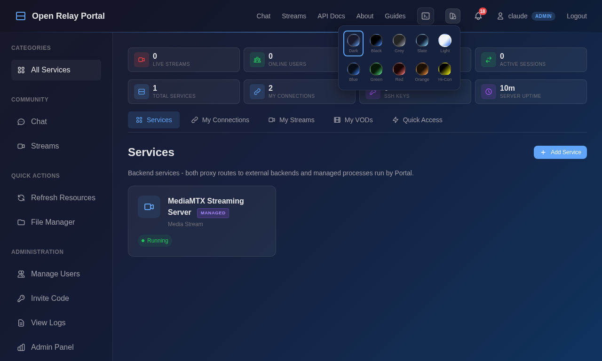
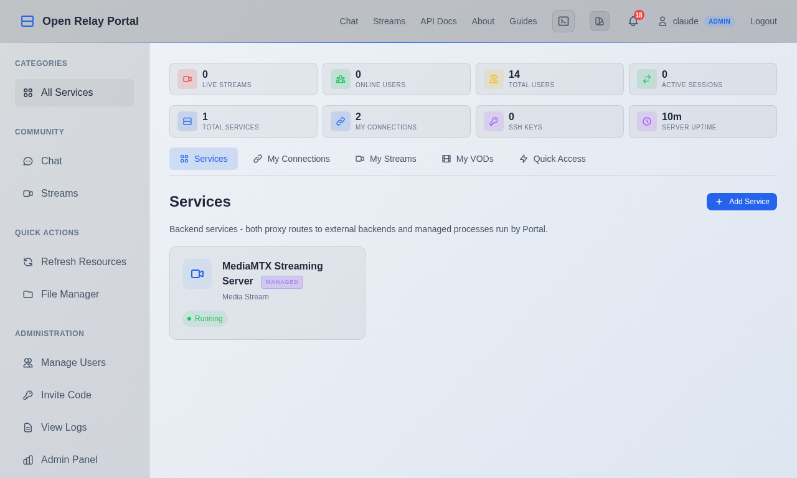
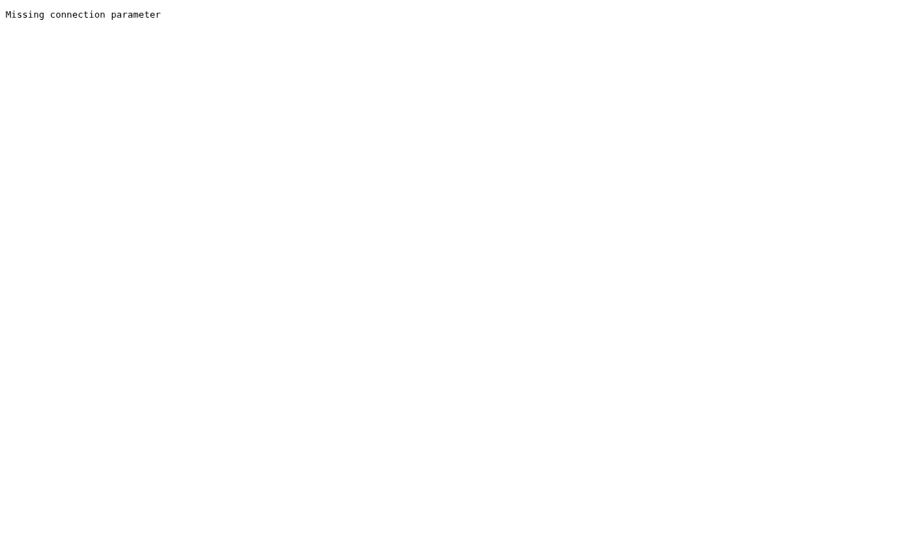
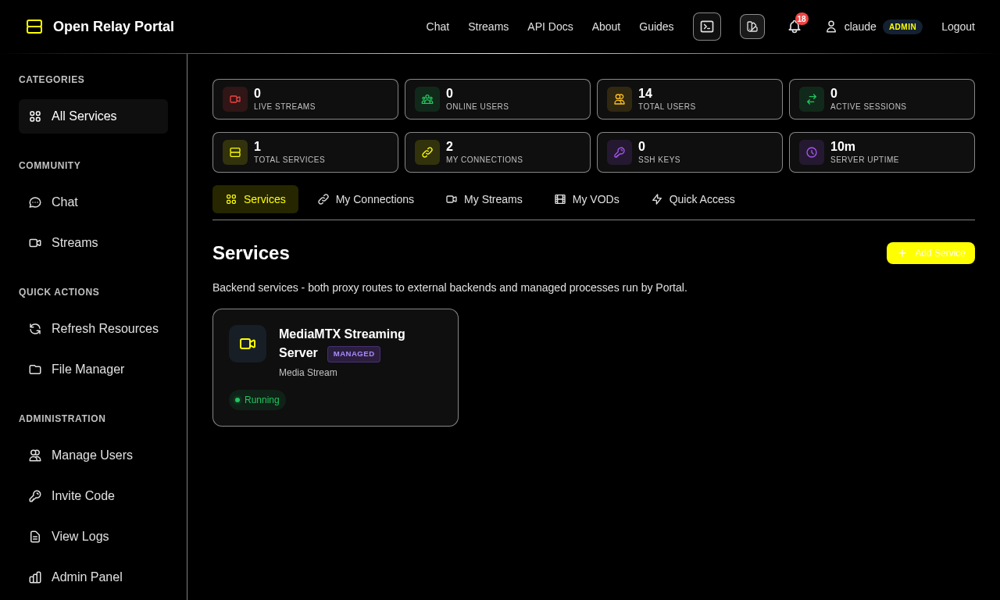

# Open Relay Portal

[](LICENSE)
[](https://python.org)
[](https://github.com/dustinm16/portal/releases)

A self-hosted, encrypted communication and infrastructure gateway. One server gives you everything — live streaming, encrypted chat, voice calls, remote access, and file management — all under your control, on your hardware, with zero third-party dependencies.

> **Your server. Your data. Your rules.** No accounts on someone else's platform. No content policies you didn't write. No subscription fees. Just your hardware running your portal.

> **Dev/example instance:** [https://portal.dddvm.xyz](https://portal.dddvm.xyz) — a live development server running the latest build.

## Why This Exists

Most of the tools people use every day for communication, streaming, and remote access are run by someone else. That means someone else holds your messages, your files, your audience, and your access credentials. If they change their terms, raise prices, or shut down — you lose everything.

Open Relay Portal puts all of it on a server you own. One installation gives you a complete communication platform, a streaming server, remote access to all your machines, and a file manager — with everything encrypted and under your control.

### For communities that want independence
- **Content creators** who want to own their platform, their audience, and 100% of their revenue
- **Organizations** that need secure internal communication without trusting their data to a third party
- **Friend groups and gaming communities** who want a private space they fully control

### For people in restrictive or dangerous environments
- **Journalists** in countries where press freedom is under attack — encrypted chat and streaming that no corporation can be compelled to hand over
- **Activists and organizers** who need communication infrastructure that can't be censored or monitored by outside parties
- **Aid workers and NGOs** operating in conflict zones where commercial services are blocked, unreliable, or under surveillance
- **Anyone in a region** where centralized infrastructure is destroyed — a single server (even a small VPS anywhere in the world) can restore communication

### For infrastructure operators
- **Homelab enthusiasts** who want a single portal to manage their entire setup from anywhere
- **Small businesses** that need remote access to internal services without maintaining a VPN
- **IT teams** who want browser-based SSH, VNC, RDP, and database access with centralized authentication

## What You Get

### Live Streaming
Broadcast video to your community — like having your own private TV channel. Stream from OBS or any RTMP-compatible app, with support for hardware-accelerated encoding (NVENC, AMF, x264). Viewers watch in their browser over HLS. Every stream is automatically recorded as VOD clips and uploaded to your own storage. Relay your stream simultaneously to Twitch, YouTube, Kick, or any custom RTMP destination. You keep full control — no platform cut, no algorithm deciding who sees your content, no surprise policy changes.

### Encrypted Chat
Message your team or community in real time — all messages are encrypted on the server so only your portal can read them. Organize conversations into channels, reply to specific messages, start threads, react with emoji, @mention people, share images, embed links and videos, and pin important messages. Search across everything with Ctrl+K. Enable desktop alerts to get browser notifications when someone mentions you or a stream goes live — even when the tab is in the background. It's a full-featured chat system that lives entirely on your hardware.

### Direct Messages
Have private conversations with one person or a small group (up to 10 people), all encrypted on the server. Supports reactions, replies, message editing, typing indicators, unread badges, and muting — everything you'd expect from a modern messaging experience, delivered instantly over WebSocket. If someone is offline, they'll see a notification when they return.

### Message Search
Find anything across your channels and DMs with full-text search. Filter by who sent it, when it was sent, or what type of content it contains. Use shortcuts like `from:user in:channel has:image before:date` to narrow results. DM search is private — you only see results from your own conversations.

### Voice Chat
Talk to people in real time with encrypted audio. Choose between push-to-talk or automatic voice detection. Audio travels directly between participants using WebRTC — it never passes through or gets stored on the server. True peer-to-peer, end-to-end encrypted voice.

### Remote Access
Control other computers from your browser — no special software needed on your end. Connect to SSH terminals, VNC desktops, RDP sessions, SPICE consoles, databases, and more — all through a secure WebSocket connection. 75 connection types are supported across 17 categories, each with a setup guide. A Quick Add bar lets you create common connections (SSH, VNC, RDP, MySQL, PostgreSQL, Proxmox, HTTP Proxy) with one click.

For web-based services, Portal includes a built-in embedded browser with tabbed browsing and keyboard shortcuts (Ctrl+T for new tab, Ctrl+W to close, Alt+arrows for back/forward). Browse web dashboards, admin panels, or any website through Portal's secure proxy. A default "Web Browser" connection with a search engine homepage is created for every user. No VPN required — if you can reach your portal, you can reach everything behind it.

### File Management
Browse, upload, download, and edit files on your server or on remote machines through the web. The file manager works with your server's local filesystem (for admins) and with any SFTP connection you've set up. When you have multiple SFTP connections, a dual-pane commander-style view lets you move files between remote machines side by side.

### System Monitoring
See what's running on your server at a glance — active processes, systemd services, network interfaces, and open ports. Start, stop, or restart services. Kill runaway processes. All integrated directly into the admin panel as a tab, so you don't need to open a terminal for routine server management.

### Data Retention
Set policies for how long chat messages, DMs, notifications, activity logs, and expired tokens are kept. Automatic cleanup runs on a schedule (default every 6 hours) with optional database compaction. Run cleanup on demand anytime from the admin panel.

### Visual Theming
Ten built-in themes — switch with the palette icon in the navbar. **Dark** (navy, default), **Black** (OLED), **Grey**, **Slate**, **Blue**, **Green**, **Red**, **Orange**, **Light**, and **High Contrast**. Your preference persists across sessions via localStorage and applies before the first paint so there's no flash.

### Administration
Manage users with a clear role hierarchy — Super Admin, Admin, Moderator, and User. Create invite codes to let people register (daily rotating, single-use, or time-limited). Require two-factor authentication. Issue API keys for automation. Manage SSH keys, monitor traffic patterns, and scan for vulnerabilities. All administration happens through the admin panel in your browser.

## Usage Examples

Here are a few ways people use Open Relay Portal:

- **"My friend needs help with their computer."** Open a VNC connection in your browser and see their screen in real time — walk them through the fix or take control directly.

- **"I need a file from my home server while I'm traveling."** Log into your portal from any browser, open the file manager, and download what you need. No VPN setup, no special app.

- **"Our team needs a private group chat with voice."** Create channels for different topics, invite your team with an invite code, and use voice chat when you need to talk. Everything stays on your server.

- **"I want to stream for my friends without a public platform."** Go live from OBS to your portal's RTMPS address. Your friends open your portal URL in their browser and watch. Recordings are saved automatically.

- **"I manage a home server with several services."** Add each service as a connection in Portal — Proxmox, Home Assistant, Grafana, Pi-hole, whatever you run. Access all of them through one authenticated dashboard in your browser, from anywhere.

- **"Our organization needs secure communication that we fully control."** Deploy Portal on your own infrastructure. All messages are encrypted at rest, voice never touches the server, and no third party can access your data — even if compelled.

## Screenshots


*Dashboard — Services, connections, streams, VODs, quick access, and system stats*


*Theme Switcher — 10 built-in themes: Dark, Black, Grey, Slate, Light, Blue, Green, Red, Orange, High Contrast*


*Light Theme — full light mode with dark text and blue accent*


*Encrypted Chat — Channels, reactions, threads, @mentions, voice chat*


*Direct Messages — Private 1:1 and group DMs with encryption at rest*


*Embedded Browser — Tabbed browsing with address bar, navigation controls, and multi-site proxy*


*Admin Panel — Server stats, traffic metrics, Shodan scanner, system resources*


*File Manager — Browse and manage server files*


*System Monitor — Processes, systemd services, network interfaces*


*Community Streams — Live streaming with HLS playback and VOD recording*


*API Documentation — Interactive endpoint reference*


*Connection Setup Guides — Step-by-step documentation for all 75 connection types*

<details>
<summary>More screenshots</summary>


*High Contrast Theme — maximum readability with yellow accent on pure black*


*Login page with TOTP 2FA support*


*Feature guide and documentation*


*Systemd service management*


*Guide detail — Requirements, setup steps, and security best practices per type*

</details>

## Quick Start

```bash
git clone https://github.com/dustinm16/portal.git
cd portal
sudo python3 server.py setup
```

That's it. The setup wizard handles everything automatically:
1. Creates a virtual environment and installs all dependencies
2. **Auto-generates a self-signed TLS certificate** (server starts immediately)
3. Generates a JWT secret and writes `.env` configuration
4. **Downloads MediaMTX** streaming server (for RTMPS/HLS live streaming)
5. Creates the database and initial admin user
6. Installs and starts a systemd service

Open `https://your-hostname` in a browser. Self-signed certs show a warning — click "Advanced" > "Proceed" to continue. Switch to Let's Encrypt or a custom certificate later via the Admin Panel or by re-running setup.

### Manual Setup

```bash
# Create virtual environment and install dependencies
python3 -m venv venv
source venv/bin/activate
pip install -r requirements.txt

# Configure (or copy .env.example and edit)
cp .env.example .env
chmod 600 .env
# Edit .env: set JWT_SECRET, HOSTNAME, SSL_CERT, SSL_KEY

# Generate a self-signed cert if you don't have one
python -c "import cert_manager; cert_manager.generate_self_signed_cert('localhost', 'certs')"

# Install MediaMTX for streaming (optional, Linux amd64)
sudo python server.py install-mediamtx

# Initialize database and create admin user
python server.py init

# Run (port 443 requires root)
sudo venv/bin/python server.py serve
```

### Requirements
- Python 3.11+
- Linux (systemd for service management features)
- Port 443 (HTTPS) — requires root, or use a higher port in `.env`

## Architecture

```
Python/aiohttp backend ──── SQLite database (FTS5 search)
       │                         │
       ├── WebSocket relay ──── Plugins (SSH, VNC, RDP, SPICE, ...)
       ├── HLS streaming ────── MediaMTX (managed process)
       ├── Chat engine ──────── Fernet encryption at rest
       ├── Direct messages ──── Encrypted 1:1 & group DMs
       ├── Message search ───── FTS5 full-text index
       ├── Voice signaling ──── WebRTC P2P (no server-side audio)
       ├── File manager ─────── Local + remote SFTP
       ├── System monitor ───── psutil + systemd
       └── Data retention ───── Configurable auto-cleanup
```

Single binary. No Docker required. No microservices. No external databases. One Python process, one SQLite file, one `.env` config.

## Security

- **HTTPS only** — TLS 1.2+ with HSTS preload, no HTTP fallback
- **Encryption at rest** — Chat messages, connection configs, stream keys, TOTP secrets all encrypted (Fernet/PBKDF2)
- **Machine-bound keys** — Encryption keys derived from hardware ID + random salt; cloning the repo cannot decrypt data
- **Argon2id** password hashing
- **Zero-knowledge voice** — WebRTC DTLS-SRTP, audio never touches the server
- **Path traversal protection** — File manager validates all paths with `Path.resolve()`
- **Input validation** — All user input sanitized, no shell injection vectors
- **Upload content security** — Uploaded files sanitized: only safe types (images, video, audio, PDF) render inline; HTML/JS/SVG forced to download to prevent stored XSS
- **API credential redaction** — Passwords and keys never returned from API endpoints
- **Stream key encryption** — SHA-256 hashed for lookups, encrypted at rest
- **Opaque connection IDs** — URL-safe tokens replace sequential integers, preventing enumeration
- **Proxy isolation** — Embedded browser strips session cookies and auth headers from upstream requests; sandboxed iframe
- **Rate limiting** — Per-IP request throttling on all endpoints
- **Security headers** — HSTS, X-Frame-Options, X-Content-Type-Options, CSP on every response

See [ARCHITECTURE.md](docs/ARCHITECTURE.md) for the full security model.

## Streaming

Publish from OBS or any RTMP client:

| Method | URL | Auth |
|--------|-----|------|
| RTMPS (recommended) | `rtmps://your-domain:1936/live` | Stream key (`live_xxx`) |
| RTMP (optional) | `rtmp://your-domain:1935/live` | Temporary token |

Playback is HLS over HTTPS. VODs are automatically recorded as 5-minute MKV chunks and uploaded to your configured SFTP storage. Multi-platform relay supports Twitch, YouTube, Kick, and custom RTMP destinations (up to 10 per stream). When a relay fails, the last ffmpeg error is persisted and viewable from the stream management panel.

## Reverse Proxy Configuration

Web interface connections (`http_proxy` plugin) support the following per-connection config options, all configurable from the connection form:

| Field | Type | Description |
|-------|------|-------------|
| `auth_header` | string (masked) | Authorization header value injected into every upstream request (e.g. `Bearer token123` or `Basic dXNlcjpwYXNz`) |
| `timeout` | integer (5–300) | Upstream request timeout in seconds (default: 60) |
| `path_rewrite_rules` | array | Regex match/replace pairs applied to the upstream request path before forwarding (e.g. strip a prefix, rewrite versioned paths) |
| `forward_headers` | array | Header names or glob patterns forwarded from the client to upstream (e.g. `X-User-*`, `X-Request-ID`). `Authorization`, `Cookie`, and `Host` are never forwarded regardless of this setting. Max 20 entries. |
| `verify_ssl` | boolean | Verify upstream SSL certificates (default: false — useful for self-signed internal certs) |
| `preserve_host` | boolean | Preserve the original `Host` header instead of rewriting to the upstream host |

## Connection Types

75 types across 17 categories: Remote Access (SSH, VNC, RDP, SPICE, SFTP, Telnet), Media Servers, *arr Stack, Download Clients, Files & Photos, Virtualization, Home Automation, Security, Monitoring, Dashboards, Dev Tools, Databases, Networking, and more. Each type has a dedicated [setup guide](/guides) with requirements, configuration steps, and security best practices. When creating a connection from a preset, inline links to both the software's official documentation and the Portal setup guide are shown directly in the modal.

## API

Full REST API with JWT authentication, API keys, and session cookies. See [API.md](docs/API.md) for the complete reference.

Interactive API documentation is available at `/api-docs` when the server is running.

## Contributing

Contributions welcome. The codebase is vanilla Python and vanilla JS — no frameworks, no build steps, no transpilation.

```bash
# Lint
pip install flake8
flake8 server.py database.py auth.py --max-line-length=120
```

## License

AGPL-3.0 — If you run a modified version as a network service, you must share your source code. This ensures the software stays free and open for everyone, especially the communities that need it most.

See [LICENSE](LICENSE) for the full text.
