# Open Relay Portal

[](LICENSE)
[](https://python.org)
[](https://github.com/dustinm16/portal/releases)

A self-hosted, encrypted communication and infrastructure gateway. One server gives you everything — live streaming, encrypted chat, voice calls, remote access, and file management — all under your control, on your hardware, with zero third-party dependencies.

> **A self-hosted alternative to Discord + Twitch + your VPN.** No accounts on someone else's server. No content moderation you didn't choose. No subscription fees. Just your hardware, your rules.

## Why This Exists

The internet's communication infrastructure is centralized. Discord owns your chat history. Twitch takes 50% of your revenue and can deplatform you overnight. Kick, YouTube, and every other platform can censor, throttle, or shut down your content at will.

**Open Relay Portal is the alternative.**

### For communities that need sovereignty
- **Content creators** who want to own their platform, their audience, and their revenue
- **Organizations** that need secure internal communication without trusting a third party
- **Gaming communities** tired of Discord's arbitrary moderation and data harvesting

### For people in hostile environments
- **Journalists** in countries where press freedom is under attack — encrypted chat and streaming that no corporation can be compelled to hand over
- **Activists and organizers** in authoritarian regimes — your server, your data, your rules
- **Aid workers and NGOs** operating in conflict zones where commercial services are blocked, monitored, or unreliable
- **War-torn regions** where centralized infrastructure is destroyed but a single server (or a VPS anywhere in the world) can restore communication

### For infrastructure operators
- **Homelab enthusiasts** who want a single portal to manage their entire infrastructure
- **Small businesses** that need VPN-less remote access to internal services
- **DevOps teams** who want SSH, VNC, RDP, and database access through a web browser

## What You Get

### Live Streaming
RTMPS ingress with HLS playback. Stream from OBS, use hardware encoding (NVENC/AMF/x264), automatic VOD recording to your own storage. No platform cut, no algorithm, no ToS surprises.

### Encrypted Chat
Real-time messaging with Fernet encryption at rest. Channels, replies, threads, reactions, @mentions, image embeds, link previews, pinned messages. Everything Discord does, except you own the database.

### Direct Messages
Private 1:1 and group DMs (up to 10 participants), all encrypted at rest. Reactions, replies, editing, typing indicators, unread badges, mute — the same features as channel chat, delivered in real-time via WebSocket. Offline users get persistent notifications.

### Message Search
Full-text search across channels and DMs powered by FTS5. Filter by user, date range, content type. Search syntax: `from:user in:channel has:image before:date`. Keyboard shortcut: Ctrl+K. DM search results restricted to your own conversations.

### Voice Chat
WebRTC peer-to-peer voice with DTLS-SRTP encryption. Push-to-talk or voice activity detection. No audio ever touches the server — true end-to-end.

### Remote Access
SSH terminals, VNC desktops, RDP sessions, SPICE consoles, database connections, Proxmox management — all through your browser over WSS. 75 connection types supported across 17 categories, with setup guides for each. Quick Add bar lets any user create common connections (SSH, VNC, RDP, MySQL, PostgreSQL, Proxmox, HTTP Proxy) with one click. No VPN required.

### File Management
Browse and edit files on the server or on remote machines via SFTP. Upload, download, create, rename, delete — all from the web UI. Commander-style dual-pane file manager when multiple SFTP connections exist, enabling drag-and-drop transfers between remote hosts.

### System Monitoring
Process manager, systemd service control, network interfaces, listening ports — integrated directly into the Admin Panel as a tab. Manage your server without opening a terminal.

### Data Retention
Admin-configurable retention policies for chat messages, DMs, notifications, activity logs, service logs, and expired tokens. Automatic cleanup runs on a configurable interval (default 6 hours) with optional database VACUUM. Run cleanup on demand from the Admin Panel.

### Administration
User management with role hierarchy (Super Admin / Admin / Moderator / User), invite codes, TOTP 2FA, API keys, SSH key management, traffic metrics, vulnerability scanning. Server file management and data retention settings integrated directly into the Admin Panel. Unified role checking across all pages with consistent role labels in profile and UI.

## Feature Comparison

| Feature | Open Relay Portal | Discord | Twitch | Guacamole | Matrix/Element | Mastodon |
|---------|:-:|:-:|:-:|:-:|:-:|:-:|
| Encrypted chat (at rest) | Yes | No | No | No | E2EE opt-in | No |
| Live streaming (RTMPS/HLS) | Yes | Go Live only | Yes | No | No | No |
| VOD recording (self-hosted) | Yes | No | Yes (platform) | No | No | No |
| Voice chat (E2E encrypted) | Yes | No | No | No | Yes | No |
| SSH/VNC/RDP remote access | Yes | No | No | Yes | No | No |
| HTTP reverse proxy | Yes | No | No | No | No | No |
| File management (SFTP) | Yes | No | No | No | No | No |
| Direct messages | Yes | Yes | Yes | No | Yes | Yes |
| Full-text search | Yes | Yes | No | No | Partial | Yes |
| Self-hosted / on-premise | Yes | No | No | Yes | Yes | Yes |
| No vendor lock-in | Yes | No | No | Yes | Yes | Yes |
| No subscription required | Yes | No | No | Yes | Yes | Yes |
| Open source | AGPL-3.0 | No | No | Apache-2.0 | Apache-2.0 | AGPL-3.0 |
| Single binary deployment | Yes | N/A | N/A | No | No | No |

## Screenshots

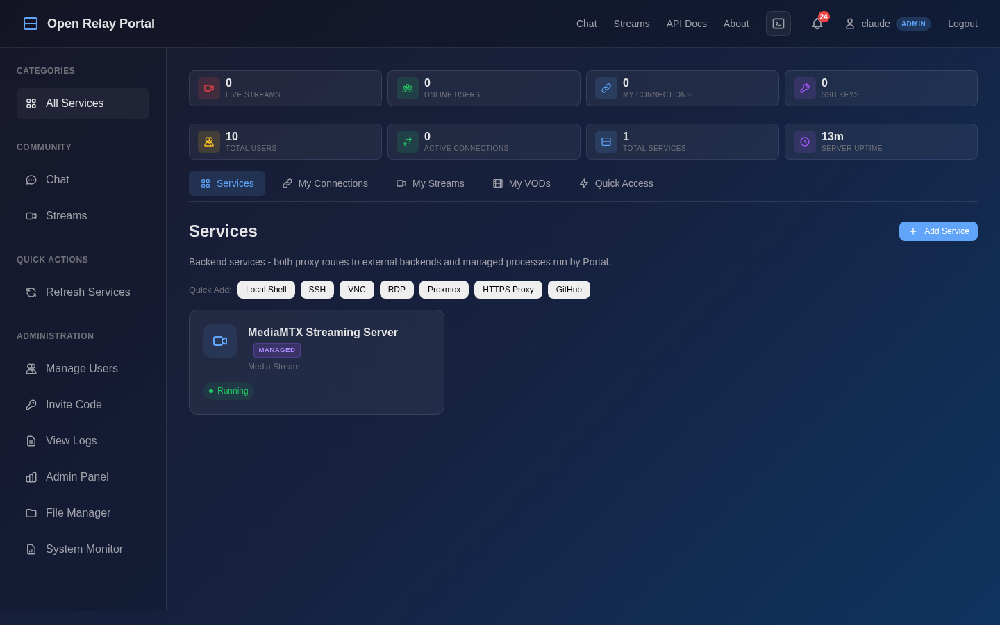
*Dashboard — Services, connections, streams, and system stats at a glance*

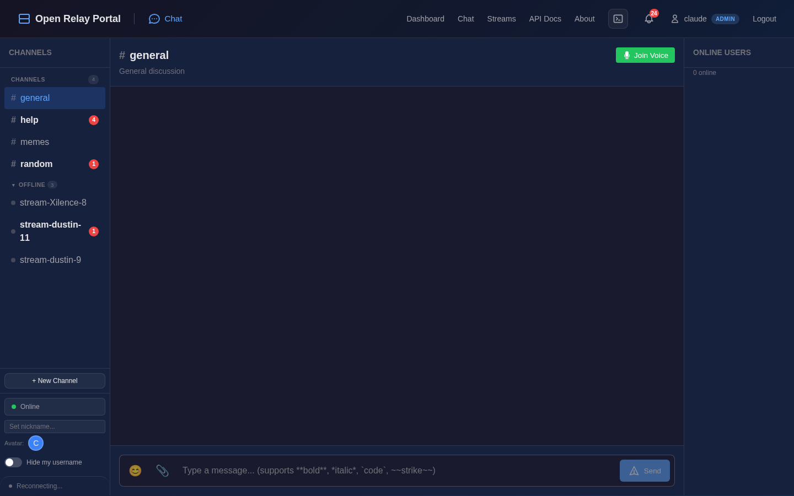
*Encrypted Chat — Channels, reactions, threads, @mentions, voice chat*

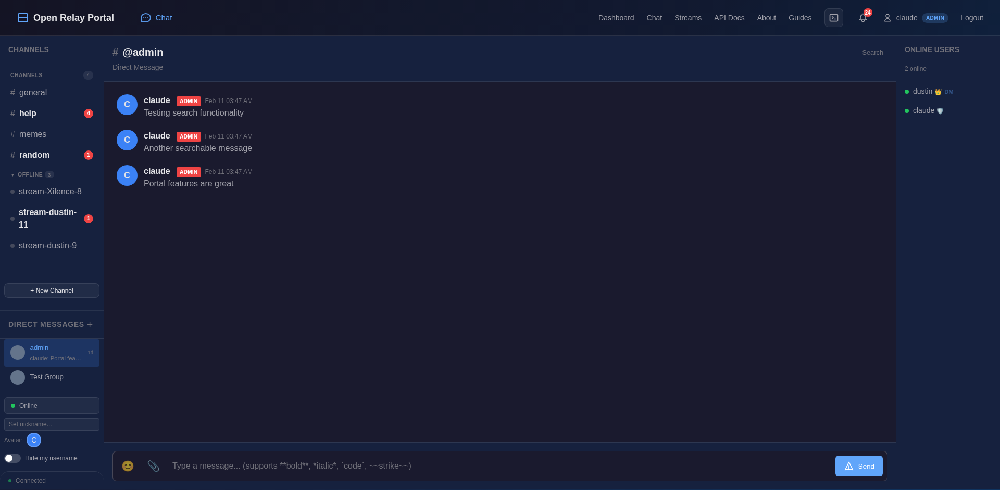
*Direct Messages — Private 1:1 and group DMs with encryption at rest*

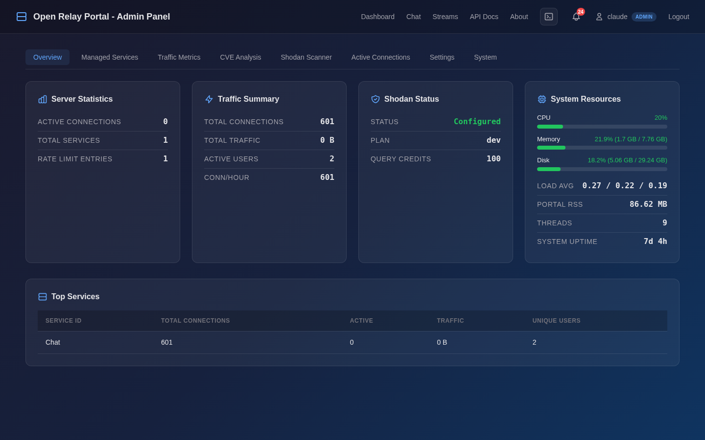
*Admin Panel — Server stats, traffic metrics, user management*

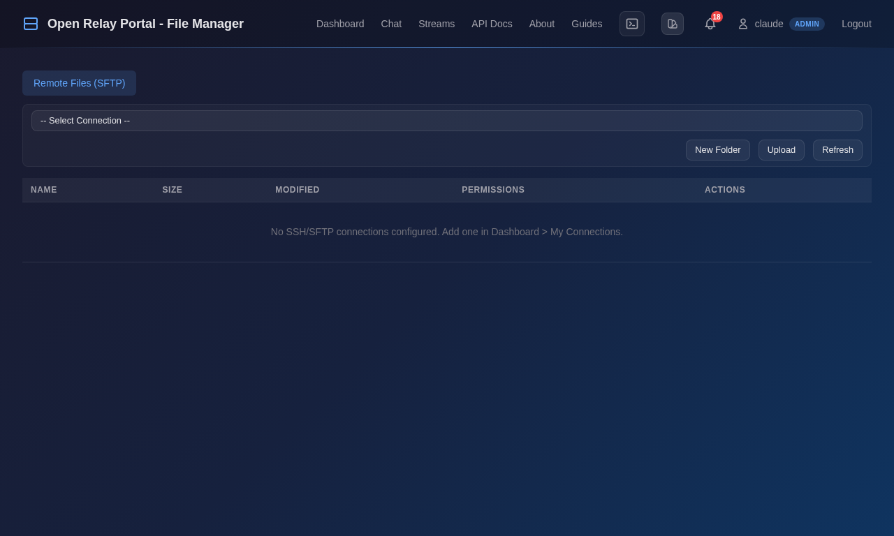
*File Manager — Browse server files or remote SFTP connections*

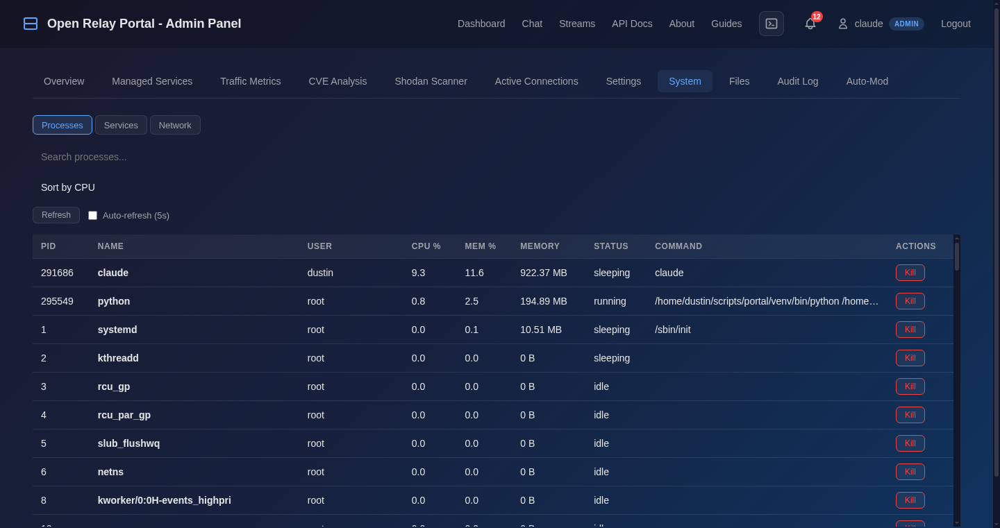
*System Monitor — Processes, systemd services, network interfaces (Admin Panel tab)*

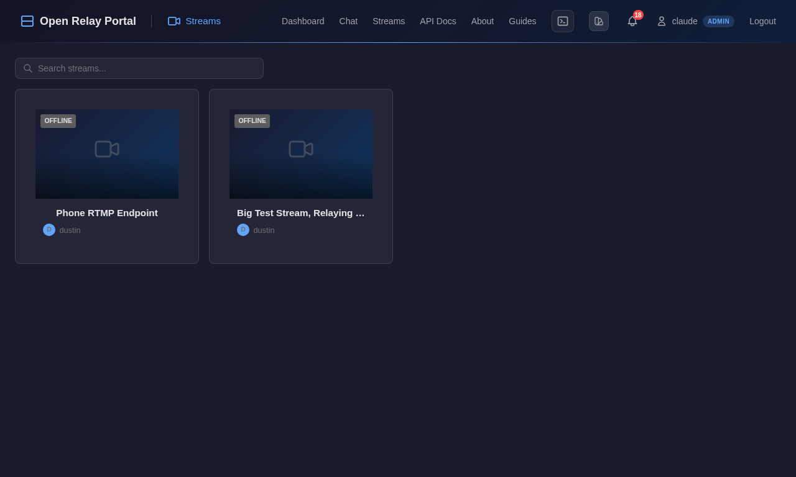
*Community Streams — Live streaming with HLS playback and VOD recording*

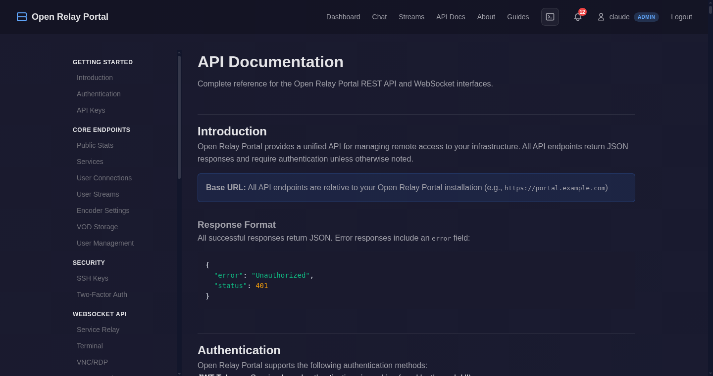
*API Documentation — Interactive endpoint reference*

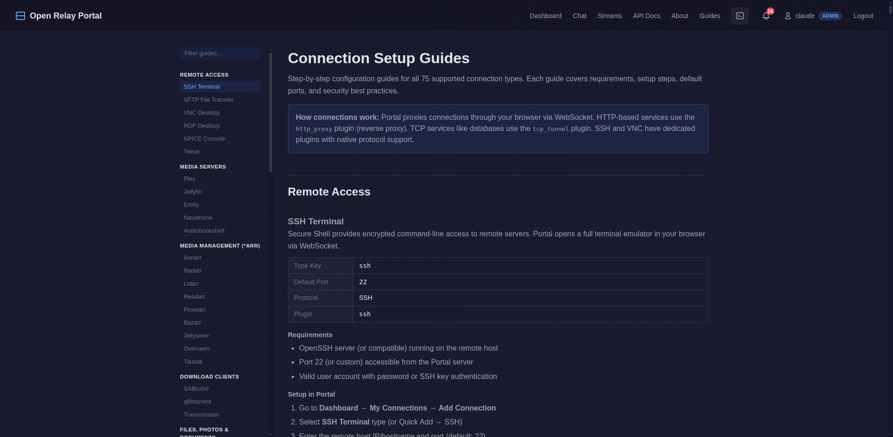
*Connection Setup Guides — Step-by-step documentation for all 75 connection types*

<details>
<summary>More screenshots</summary>

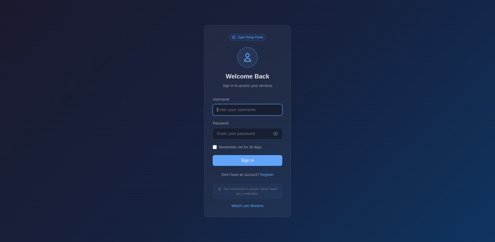
*Login page with TOTP 2FA support*

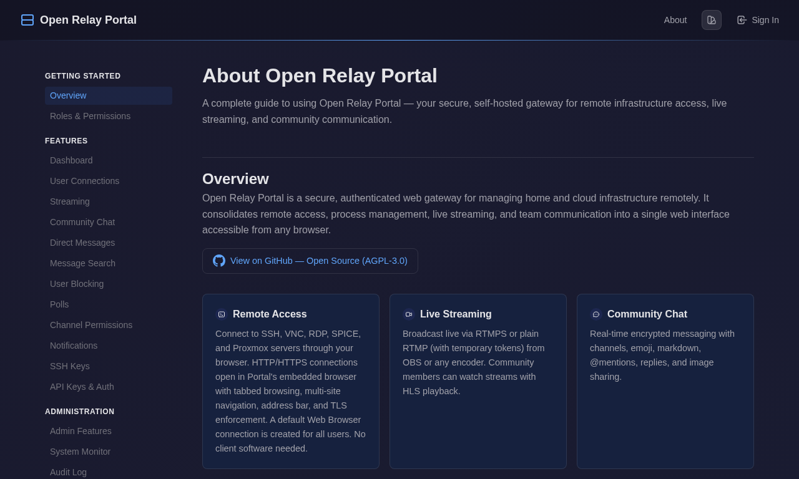
*Feature guide and documentation*

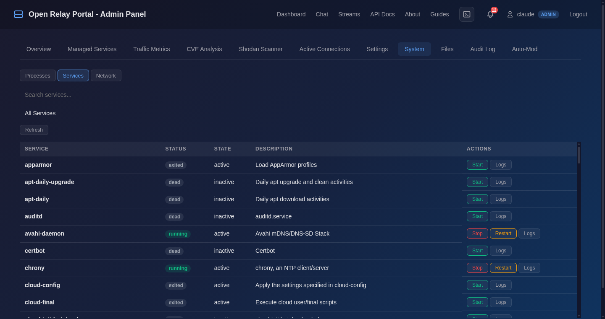
*Systemd service management*

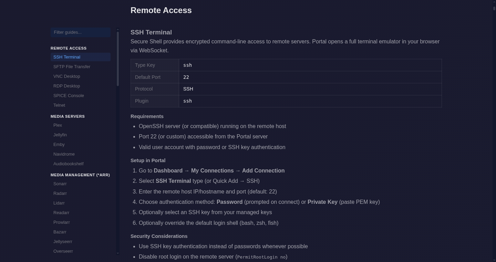
*Guide detail — Requirements, setup steps, and security best practices per type*

</details>

## Quick Start

```bash
git clone https://github.com/dustinm16/portal.git
cd portal
sudo python3 server.py setup
```

That's it. The setup wizard handles everything automatically:
1. Creates a virtual environment and installs all dependencies
2. **Auto-generates a self-signed TLS certificate** (server starts immediately)
3. Generates a JWT secret and writes `.env` configuration
4. **Downloads MediaMTX** streaming server (for RTMPS/HLS live streaming)
5. Creates the database and initial admin user
6. Installs and starts a systemd service

Open `https://your-hostname` in a browser. Self-signed certs show a warning — click "Advanced" > "Proceed" to continue. Switch to Let's Encrypt or a custom certificate later via the Admin Panel or by re-running setup.

### Manual Setup

```bash
# Create virtual environment and install dependencies
python3 -m venv venv
source venv/bin/activate
pip install -r requirements.txt

# Configure (or copy .env.example and edit)
cp .env.example .env
chmod 600 .env
# Edit .env: set JWT_SECRET, HOSTNAME, SSL_CERT, SSL_KEY

# Generate a self-signed cert if you don't have one
python -c "import cert_manager; cert_manager.generate_self_signed_cert('localhost', 'certs')"

# Install MediaMTX for streaming (optional, Linux amd64)
sudo python server.py install-mediamtx

# Initialize database and create admin user
python server.py init

# Run (port 443 requires root)
sudo venv/bin/python server.py serve
```

### Requirements
- Python 3.11+
- Linux (systemd for service management features)
- Port 443 (HTTPS) — requires root, or use a higher port in `.env`

## Architecture

```
Python/aiohttp backend ──── SQLite database (FTS5 search)
       │                         │
       ├── WebSocket relay ──── Plugins (SSH, VNC, RDP, SPICE, ...)
       ├── HLS streaming ────── MediaMTX (managed process)
       ├── Chat engine ──────── Fernet encryption at rest
       ├── Direct messages ──── Encrypted 1:1 & group DMs
       ├── Message search ───── FTS5 full-text index
       ├── Voice signaling ──── WebRTC P2P (no server-side audio)
       ├── File manager ─────── Local + remote SFTP
       ├── System monitor ───── psutil + systemd
       └── Data retention ───── Configurable auto-cleanup
```

Single binary. No Docker required. No microservices. No external databases. One Python process, one SQLite file, one `.env` config.

## Security

- **HTTPS only** — TLS 1.2+ with HSTS preload, no HTTP fallback
- **Encryption at rest** — Chat messages, connection configs, stream keys all encrypted (Fernet/PBKDF2)
- **Machine-bound keys** — Encryption keys derived from hardware ID + random salt; cloning the repo cannot decrypt data
- **Argon2id** password hashing
- **Zero-knowledge voice** — WebRTC DTLS-SRTP, audio never touches the server
- **Path traversal protection** — File manager validates all paths with `Path.resolve()`
- **Input validation** — All user input sanitized, no shell injection vectors
- **API credential redaction** — Passwords and keys never returned from API endpoints
- **Stream key encryption** — SHA-256 hashed for lookups, encrypted at rest
- **Rate limiting** — Per-IP request throttling on all endpoints
- **Security headers** — HSTS, X-Frame-Options, X-Content-Type-Options, CSP on every response

See [ARCHITECTURE.md](docs/ARCHITECTURE.md) for the full security model (28 documented security features).

## Streaming

Publish from OBS or any RTMP client:

| Method | URL | Auth |
|--------|-----|------|
| RTMPS (recommended) | `rtmps://your-domain:1936/live` | Stream key (`live_xxx`) |
| RTMP (optional) | `rtmp://your-domain:1935/live` | Temporary token |

Playback is HLS over HTTPS. VODs are automatically recorded as 5-minute MKV chunks and uploaded to your configured SFTP storage.

## Connection Types

75 types across 17 categories: Remote Access (SSH, VNC, RDP, SPICE, SFTP, Telnet), Media Servers, *arr Stack, Download Clients, Files & Photos, Virtualization, Home Automation, Security, Monitoring, Dashboards, Dev Tools, Databases, Networking, and more. Each type has a dedicated [setup guide](/guides) with requirements, configuration steps, and security best practices. When creating a connection from a preset, inline links to both the software's official documentation and the Portal setup guide are shown directly in the modal.

## API

Full REST API with JWT authentication, API keys, and session cookies. See [API.md](docs/API.md) for the complete reference.

Interactive API documentation is available at `/api-docs` when the server is running.

## Contributing

Contributions welcome. The codebase is vanilla Python and vanilla JS — no frameworks, no build steps, no transpilation.

```bash
# Lint
pip install flake8
flake8 server.py database.py auth.py --max-line-length=120
```

## Related Projects

If you're looking for self-hosted alternatives in specific categories:

- **Chat**: [Matrix/Element](https://matrix.org), [Rocket.Chat](https://rocket.chat), [Mattermost](https://mattermost.com)
- **Streaming**: [Owncast](https://owncast.online), [Peertube](https://joinpeertube.org)
- **Remote Access**: [Guacamole](https://guacamole.apache.org), [Rustdesk](https://rustdesk.com)

Open Relay Portal combines all three into a single server with unified authentication, encrypted storage, and zero external dependencies.

## License

AGPL-3.0 — If you run a modified version as a network service, you must share your source code. This ensures the software stays free and open for everyone, especially the communities that need it most.

See [LICENSE](LICENSE) for the full text.
